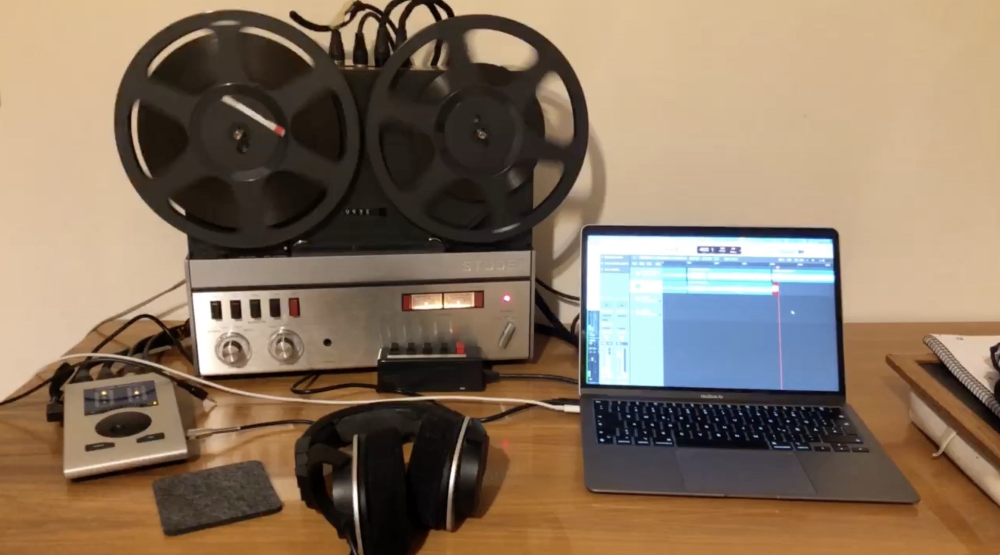

# Bandsalat

```
╔═══════════════════════════════════════════════════════════════════════════════╗
║                                                                               ║
║    ██████╗  █████╗ ███╗   ██╗██████╗ ███████╗ █████╗ ██╗      █████╗ ████████╗║
║    ██╔══██╗██╔══██╗████╗  ██║██╔══██╗██╔════╝██╔══██╗██║     ██╔══██╗╚══██╔══╝║
║    ██████╔╝███████║██╔██╗ ██║██║  ██║███████╗███████║██║     ███████║   ██║   ║
║    ██╔══██╗██╔══██║██║╚██╗██║██║  ██║╚════██║██╔══██║██║     ██╔══██║   ██║   ║
║    ██████╔╝██║  ██║██║ ╚████║██████╔╝███████║██║  ██║███████╗██║  ██║   ██║   ║
║    ╚═════╝ ╚═╝  ╚═╝╚═╝  ╚═══╝╚═════╝ ╚══════╝╚═╝  ╚═╝╚══════╝╚═╝  ╚═╝   ╚═╝   ║
║                                                                               ║
║                   Machine Learning Emulation of a Tape Deck                   ║
║                                                                               ║
╚═══════════════════════════════════════════════════════════════════════════════╝
```

> Transform clean digital audio to sound like it was recorded through a vintage Revox A77 reel-to-reel tape recorder.



---

## What is Bandsalat?

In colloquial German, **"Bandsalat"** (literally "tape salad") refers to tangled magnetic tape within the mechanics of a playback device, such as a cassette or video recorder. The tape can become damaged due to rapidly switching between forward and rewind, uneven tape movement, or excessively loose or tight winding.

### Project Goal

We want to digitally reproduce the sound characteristics of an old tape recorder. The distinctive sonic character of vintage tape recordings—warmth, subtle saturation, and unique harmonic distortion—stands in contrast to the precision and clarity of modern digital recordings.

**Our approach**: Train a machine learning model on paired "before/after" audio samples to learn the acoustic transformation that analog tape imparts on audio.

---

## How It Works

```
┌─────────────────────────────────────────────────────────────────────────────┐
│                           BANDSALAT PIPELINE                                │
├─────────────────────────────────────────────────────────────────────────────┤
│                                                                             │
│   BEFORE (Clean)              TAPE RECORDING              AFTER (Tape)      │
│   ┌───────────┐              ┌───────────┐              ┌───────────┐       │
│   │  Digital  │    ────▶     │  Revox    │    ────▶     │   Tape    │       │
│   │   Audio   │              │    A77    │              │ Processed │       │
│   └───────────┘              └───────────┘              └───────────┘       │
│        │                                                      │             │
│        │                    ML TRAINING                       │             │
│        └──────────────────────┬───────────────────────────────┘             │
│                               │                                             │
│                               ▼                                             │
│                     ┌─────────────────┐                                     │
│                     │   Transformer   │                                     │
│                     │     Model       │                                     │
│                     └─────────────────┘                                     │
│                               │                                             │
│                               ▼                                             │
│                     ┌─────────────────┐                                     │
│                     │   Clean Audio   │──▶ "Virtual Tape" Output            │
│                     │     (New)       │                                     │
│                     └─────────────────┘                                     │
│                                                                             │
└─────────────────────────────────────────────────────────────────────────────┘
```

### Pipeline Steps

1. **Data Collection** - Gather diverse audio samples (drums, instruments)
2. **Preprocessing** - Normalize audio levels, add alignment markers
3. **Compilation** - Combine files with spoken digits and delimiter beeps
4. **Recording** - Play through tape machine, capture before/after
5. **Alignment** - Detect delimiters to precisely align pairs
6. **Chunking** - Split into 50ms segments for training
7. **Training** - Train ML model on paired chunks
8. **Inference** - Apply trained model to new audio

---

## Technical Specifications

| Specification | Value |
|---------------|-------|
| Sample Rate | 96 kHz |
| Bit Depth | 32-bit float |
| Channels | Stereo |

### Equipment

| Equipment | Model |
|-----------|-------|
| Tape Recorder | Revox A77 |
| Tape | HS ORF (broadcast quality) |

---

## Directory Structure

```
bandsalat/
│
├── config.json                 # Project path configuration
├── pyproject.toml              # Python dependencies (uv)
├── Makefile                    # Build automation
├── uv.lock                     # Dependency lock file
│
├── src/                        # Source code
│   ├── main.py                 # Entry point
│   └── utils/
│       ├── __init__.py
│       └── config.py           # Configuration management
│
├── notebooks/                  # Jupyter notebooks
│   ├── demo-audio-compiler.ipynb         # Compile audio with markers
│   ├── demo-read-audiofiles.ipynb        # Load and visualize audio
│   ├── demo-loudness-normalisation.ipynb # Normalize audio levels
│   ├── demo-audio-chunking.ipynb         # Split audio into chunks
│   └── demo-play-before-after-audio.ipynb # Compare before/after
│
├── docs/                       # Documentation
│   ├── PROJECT-PLAN.md         # Detailed project roadmap
│   └── ALIGNMENT-ALGORITHMS.md # Alignment algorithm reference
│
├── data/                       # Data files (git-ignored)
│   ├── models/                 # Trained model checkpoints
│   ├── playground/             # Scratch space for experiments
│   └── audio/
│       ├── assets/             # Audio utilities
│       │   ├── audio_delimiters/      # Beeps, silence markers
│       │   ├── free-spoken-digit-dataset/  # Spoken digits (0-9)
│       │   └── samples/               # Source drum samples
│       └── datasets/           # Training datasets
│           ├── dataset-alfred/        # Placeholder
│           ├── dataset-berta/         # Main dataset (~4,586 pairs)
│           │   ├── tape-input/
│           │   ├── tape-input-chunks/
│           │   ├── tape-output-recordings/
│           │   └── tape-output-recordings-chunks/
│           └── dataset-charlie/       # Placeholder
│
├── tests/                      # Unit tests
│   ├── __init__.py
│   └── test_config.py
│
├── resources/                  # Reference materials
│   └── research/               # Research papers on ML audio approaches
│
├── AGENTS.md                   # Development guidelines
├── CLAUDE.md                   # AI assistant instructions
└── README.md                   # This file
```

---

## Prerequisites

- **Python** 3.12 or higher
- **[uv](https://docs.astral.sh/uv/)** - Fast Python package manager
- **ffmpeg** - For audio format conversion

### Install uv

```bash
# macOS/Linux
curl -LsSf https://astral.sh/uv/install.sh | sh

# Or with Homebrew
brew install uv
```

### Install ffmpeg

```bash
# macOS
brew install ffmpeg

# Ubuntu/Debian
sudo apt install ffmpeg
```

---

## Quick Start

```bash
# 1. Clone the repository
git clone https://github.com/florianbuetow/xmas-hackathon-2025-bandsalat.git
cd xmas-hackathon-2025-bandsalat

# 2. Initialize the project
make init

# 3. Run the main program
make run

# 4. Launch Jupyter notebooks
make jupyter
```

---

## Makefile Commands

| Command | Description |
|---------|-------------|
| `make help` | Show available commands |
| `make init` | Initialize project (create directories, sync dependencies) |
| `make run` | Run the main program (`src/main.py`) |
| `make jupyter` | Launch Jupyter notebook server |
| `make test` | Run unit tests with pytest |
| `make clean` | Remove generated files and caches |
| `make destroy` | Remove `.venv` directory |

### Makefile Details

```makefile
# All Python execution uses uv (never python directly)
init:
    mkdir -p src notebooks tests
    mkdir -p data/models data/playground data/audio/assets data/audio/datasets data/audio/datasets-workdir
    uv sync --all-extras

run:
    uv run src/main.py

jupyter:
    uv run jupyter notebook --NotebookApp.token='' --NotebookApp.password=''

test:
    uv run pytest tests/ -v
```

---

## Configuration

### config.json

The project uses a centralized configuration file for path management:

```json
{
    "paths": {
        "data": "data",
        "models": "data/models",
        "audio": "data/audio",
        "audio_assets": "data/audio/assets",
        "datasets": "data/audio/datasets",
        "datasets_workdir": "data/audio/datasets-workdir",
        "playground": "data/playground"
    }
}
```

### Config Class

Access paths programmatically via the `Config` singleton:

```python
from src.utils.config import Config

cfg = Config.get_instance()

# Get paths
cfg.get_project_root()      # /path/to/bandsalat
cfg.get_data_dir()          # /path/to/bandsalat/data
cfg.get_audio_dir()         # /path/to/bandsalat/data/audio
cfg.get_datasets_dir()      # /path/to/bandsalat/data/audio/datasets
cfg.get_audio_assets_dir()  # /path/to/bandsalat/data/audio/assets

# Debug: print all paths
cfg.print_paths()
```

---

## Notebooks

| Notebook | Purpose |
|----------|---------|
| `demo-audio-compiler.ipynb` | Compile audio files with markers and delimiters |
| `demo-read-audiofiles.ipynb` | Load and visualize WAV files with librosa |
| `demo-loudness-normalisation.ipynb` | Normalize audio to target dBFS levels |
| `demo-audio-chunking.ipynb` | Split audio into 50ms training chunks |
| `demo-play-before-after-audio.ipynb` | Compare before/after audio pairs |

---

## Available Datasets

| Dataset | Description | Status |
|---------|-------------|--------|
| `dataset-alfred` | 10 before/after recording pairs | Complete |
| `dataset-berta` | ~4,586 before/after chunk pairs at various normalizations | Complete |
| `dataset-charlie` | 9 before/after recording pairs | Complete |

### Dataset-berta Structure

```
dataset-berta/
├── README.md                      # Dataset documentation
├── tape-input/                    # Original audio segments
├── tape-input-chunks/             # Chunked original (~4,586 files)
├── tape-output-recordings/        # Tape-processed segments
└── tape-output-recordings-chunks/ # Chunked tape audio (~4,586 files)
```

---

## Audio Assets

### Audio Delimiters

Used for alignment between before/after recordings:

| File | Purpose |
|------|---------|
| `beep-07a.wav` | Short beep marker |
| `beep-08b.wav` | Alternative beep |
| `beep-10.wav` | Longer beep |
| `silence-0.5s.wav` | 500ms silence gap |
| `silence-1s.wav` | 1 second silence gap |

### Free Spoken Digit Dataset

- **Files**: 3,000 WAV recordings
- **Content**: Digits 0-9
- **Speakers**: 6 (jackson, nicolas, theo, yweweler, george, lucas)
- **Format**: 8kHz mono WAV
- **Naming**: `{digit}_{speaker}_{index}.wav`
- **Purpose**: Spoken batch numbers for alignment

---

## Documentation

| Document | Description |
|----------|-------------|
| [PROJECT-PLAN.md](docs/PROJECT-PLAN.md) | Detailed project roadmap and ML pipeline |
| [ALIGNMENT-ALGORITHMS.md](docs/ALIGNMENT-ALGORITHMS.md) | Technical reference for audio alignment |
| [AGENTS.md](AGENTS.md) | Development rules and guidelines |
| [resources/research/](resources/research/) | Research papers on ML approaches for audio transformation |

---

## Development Guidelines

See [AGENTS.md](AGENTS.md) for complete development rules. Key points:

### Python Execution

```bash
# Always use uv run
uv run src/main.py       # Correct
uv run pytest tests/     # Correct

# Never use python directly
python src/main.py       # Wrong
python3 src/main.py      # Wrong
```

### Dependencies

```bash
# Always use uv sync
uv sync                  # Correct

# Never use pip
pip install package      # Wrong
```

### Git Commits

- No AI attribution in commit messages
- Never use `git add -A` or `git add .`
- Stage files explicitly

### Testing

- Run tests after every code change: `make test`
- Verify program runs: `make run`

### Project Structure

- Source code in `src/`
- Scripts in `scripts/`
- Never create Python files in project root

---

## Dependencies

Core dependencies (see `pyproject.toml`):

| Package | Purpose |
|---------|---------|
| `jupyter` | Interactive notebooks |
| `librosa` | Audio loading and analysis |
| `pydub` | Audio manipulation (dBFS normalization) |
| `pytest` | Testing (dev dependency) |

---

## License

[Add license information]

---

## Acknowledgments

- **Revox A77** - The iconic Swiss tape recorder used for data collection
- **Free Spoken Digit Dataset** - Open dataset for spoken digit recordings
- **MusicRadar** - Drum sample library

---

*Built for the Christmas Hackathon 2025*
